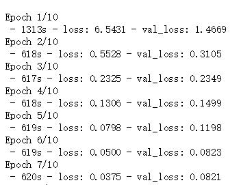
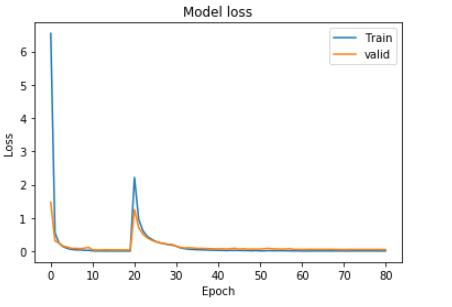

# 项目所需

* jupyter notebook
* python
* 安装包参见[tfdl_py35_requirements.txt](tfdl_py35_requirements.txt)

# 训练图片集

图片集来源于课程项目提供[链接](https://s3.cn-north-1.amazonaws.com.cn/static-documents/nd009/MLND+Capstone/Mathematical_Expression_Recognition_train.zip)

# 训练耗时

* 显卡GeForce GTX 980 Ti  
* Compute Capability 5.2
* 每轮约10多分钟

